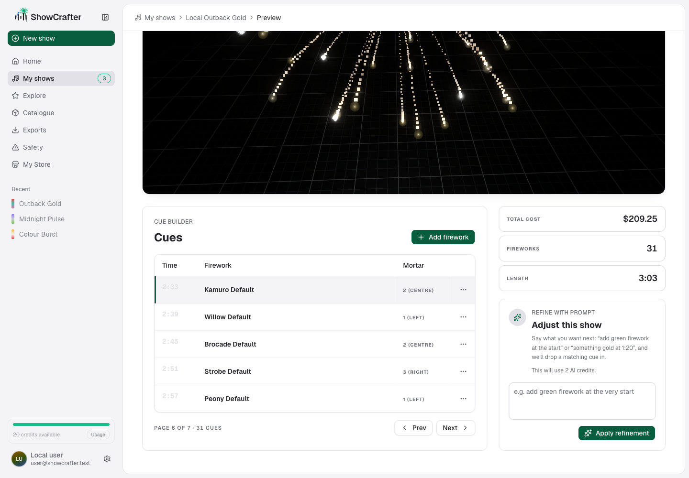
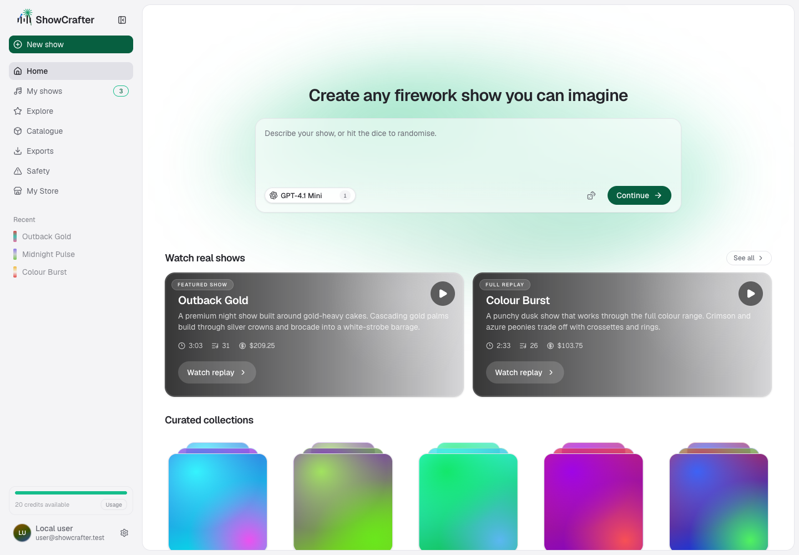
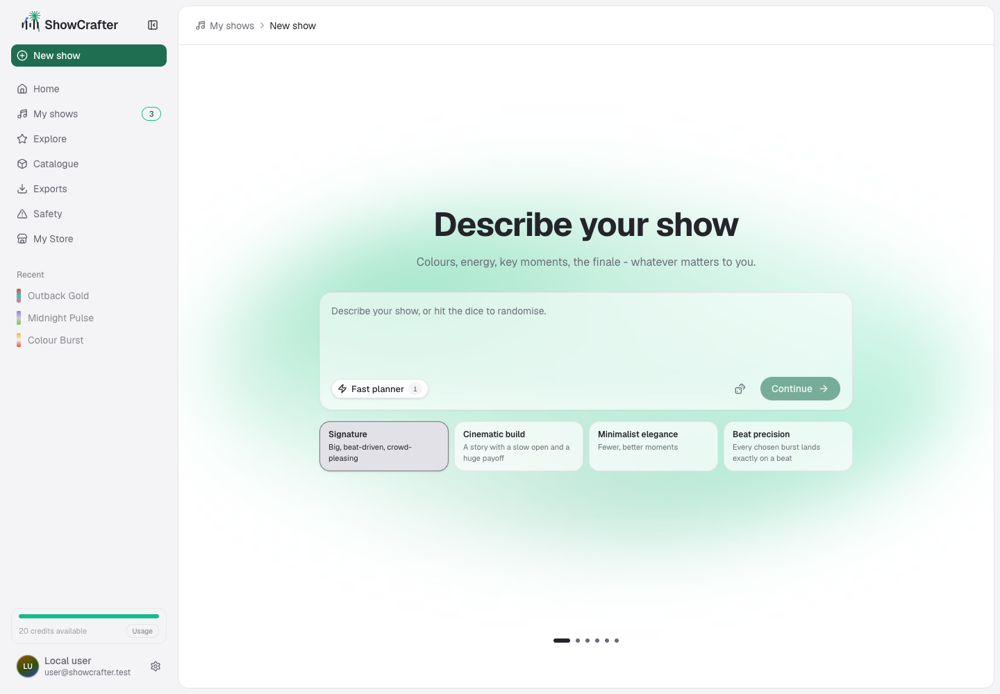
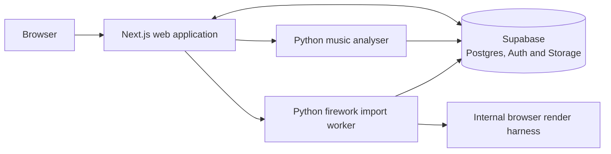

<div align="center">

# ShowCrafter

### Design. Choreograph. Preview.

Build complete firework shows from catalogue products, shape the cue timeline,
sync the plan to music and preview the result in the browser.

[**Live demo**](https://showcrafter.vercel.app) · [**Latest release**](https://github.com/HarryRandall/FireworkEntertAInment/releases/latest)

[](https://github.com/HarryRandall/FireworkEntertAInment/actions/workflows/ci.yml)
[](https://github.com/HarryRandall/FireworkEntertAInment/releases/latest)



</div>

## What is ShowCrafter?

ShowCrafter is a planning application for turning a creative brief, practical site
constraints and an optional soundtrack into a reviewable firework show. Plans use
real catalogue products, keep cue timing editable and produce a derived shopping
list before anything is finalised.

It serves three connected experiences:

- planners create, refine, preview and export shows;
- retailers manage assortments and offer public QR-based planning for fixed bundles;
- administrators maintain catalogue data, templates and import new fireworks from video.

ShowCrafter is a planning tool. It does not replace local regulations, licensed
operators or professional safety advice.

## Product workflow

1. **Describe the show.** Set the mood, style, duration, budget, firework types and site width.
2. **Add music if useful.** Upload a soundtrack for optional structural analysis, or continue without one.
3. **Generate deliberately.** The final Generate action creates the show and plans catalogue-backed cues.
4. **Review and refine.** Inspect the browser replay, adjust the cue sequence and review the shopping list.
5. **Share or operate a range.** Export a plan, start from a published template, or use a retailer assortment through the public QR flow.

<table>
  <tr>
    <td width="50%"></td>
    <td width="50%"></td>
  </tr>
  <tr>
    <td align="center"><sub>Discover seeded shows and curated templates</sub></td>
    <td align="center"><sub>Build a show through a focused six-step flow</sub></td>
  </tr>
</table>

## Key capabilities

- searchable firework catalogue with renderer-backed previews;
- guided show creation and deterministic catalogue-aware cue planning;
- optional music analysis and music-aware choreography;
- interactive Three.js replay, cue editing and timeline review;
- published show templates and a browsable library;
- derived shopping lists, show guides and exports;
- retailer assortment management with public QR and kiosk flows;
- permission-aware admin tools for catalogue editing, presets and video imports.

External AI, music-provider and import-worker integrations are optional in local
development. My Store analytics and credit top-ups remain clearly labelled preview
experiences rather than production-complete capabilities.

## Architecture



The web application owns routes, server actions, shared UI and domain logic.
Supabase supplies persistence, authentication, row-level security and media
storage. The two Python services are independently deployable boundaries for
music analysis and firework-video reconstruction.

See [Architecture](docs/architecture.md) for ownership and dependency rules,
[Development](docs/development.md) for checks and deployments, and
[Database](docs/database.md) for the reproducible local and hosted setup.

## Technology

| Area         | Stack                                                            |
| ------------ | ---------------------------------------------------------------- |
| Web          | Next.js 16, React 19, TypeScript 5, Tailwind CSS 4               |
| Rendering    | Three.js and browser WebGL                                       |
| Data         | Supabase Postgres, Auth and Storage                              |
| Services     | Python 3.11, Modal-compatible deployments, FFmpeg and Playwright |
| Integrations | OpenRouter, Jamendo and Upstash Redis when configured            |
| Delivery     | pnpm workspace, GitHub Actions and Vercel                        |

## Getting started

Use Node 24, pnpm 12.3.4 and Docker:

```bash
nvm use
corepack enable pnpm
pnpm install --frozen-lockfile
pnpm db:setup
pnpm db:env
pnpm dev
```

The local setup installs the reusable catalogue plus synthetic accounts and
example shows. It never targets a hosted project. See [Database](docs/database.md)
for the local accounts, reset behaviour and hosted installation process.

## Repository

```text
.agents/skills/                  Project workflows for coding agents
apps/web/app/                    Next.js routes and route-owned code
apps/web/lib/                    Shared application domains and integrations
apps/web/ui/                     Shared primitives, patterns, shells and features
services/music-analyser/         Music analysis service
services/firework-import-worker/ Firework reconstruction and validation service
supabase/                        Migrations, bootstrap content and SQL tests
docs/                            Architecture, development and database guides
```

Route-owned code stays near its route. Shared code lives with the domain that owns
it, including `lib/access`, `lib/shows`, `lib/show-templates`,
`lib/firework-import`, `lib/fireworks` and `lib/cue-generation`.

## Development and testing

```bash
pnpm typecheck      # Focused TypeScript check
pnpm test           # Web behaviour and architecture tests
pnpm test:analyser  # Music analyser service tests
pnpm test:worker    # Firework import worker tests
pnpm db:test        # Transactional SQL contract suites
pnpm audit:ui       # Page inventory and shared-UI import review
pnpm check          # Formatting, database tooling, lint, types, tests and build
```

The renderer contract spans the web app, import worker and database. Any change to
its fingerprint must ship across all three boundaries together. Full setup,
verification and release notes live in [Development](docs/development.md).

## Project information

ShowCrafter was developed as an Australian National University COMP3500/4500
project with ICON Pyrotechnics International Co Ltd and International Fireworks
Pty Ltd as project stakeholders. Repository contributions are recorded on the
[GitHub contributors page](https://github.com/HarryRandall/FireworkEntertAInment/graphs/contributors).

Releases use semantic versioning and GitHub Releases as the public source of truth.
Security issues should be reported privately through [the security policy](SECURITY.md).
