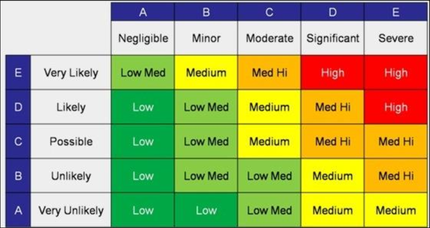

⚠️ A living register of the risks that could disrupt ShowCrafter and the mitigations we have in place for each. Risks are scored from the matrix below and re-reviewed at every sprint boundary.

[//]: # (table_of_contents is not supported)

---

## 📊 Risk Matrix

 

---

## 📋 Risk Register

 | Risk | Likelihood | Impact | Priority | 
 | ---- | ---- | ---- | ---- | 
 | Scope is too large | 2 | 5 | Medium-High | 
 | Lack of communication across the team | 2 | 5 | Medium-High | 
 | Feature creep | 2 | 4 | Medium | 
 | Team availability changes | 3 | 3 | Medium | 
 | Git conflicts on binary files | 4 | 2 | Low-Medium | 
 | Disorganised issue handling | 2 | 2 | Low-Medium | 

---

## 🔍 Risk Details

🚧 **Scope is too large** · Likelihood 2 · Impact 5 · **Medium-High**

	💬 **Lack of communication across the team** · Likelihood 2 · Impact 5 · **Medium-High**

	📌 **Feature creep** · Likelihood 2 · Impact 4 · **Medium**

	🗓️ **Team availability changes** · Likelihood 3 · Impact 3 · **Medium**

	🤝 **Git conflicts on binary files** · Likelihood 4 · Impact 2 · **Low-Medium**

	📁 **Disorganised issue handling** · Likelihood 2 · Impact 2 · **Low-Medium**

	